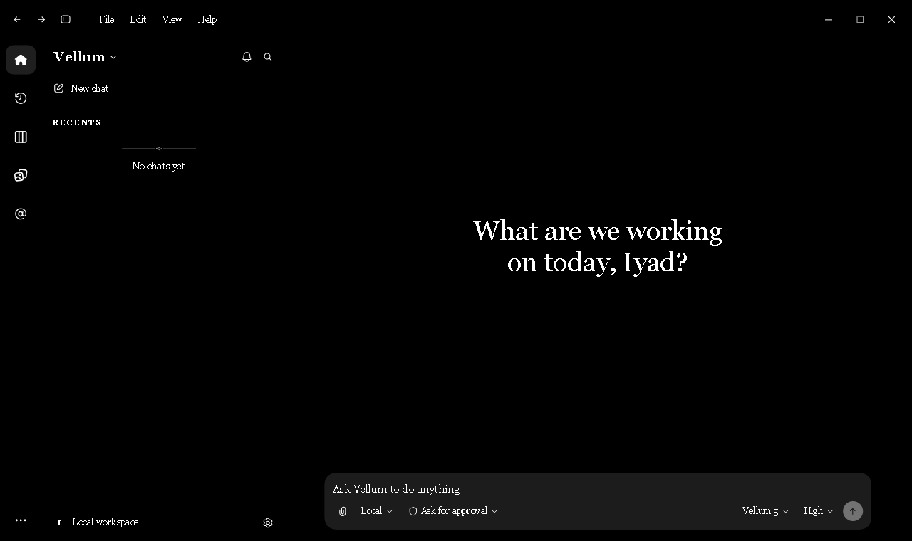
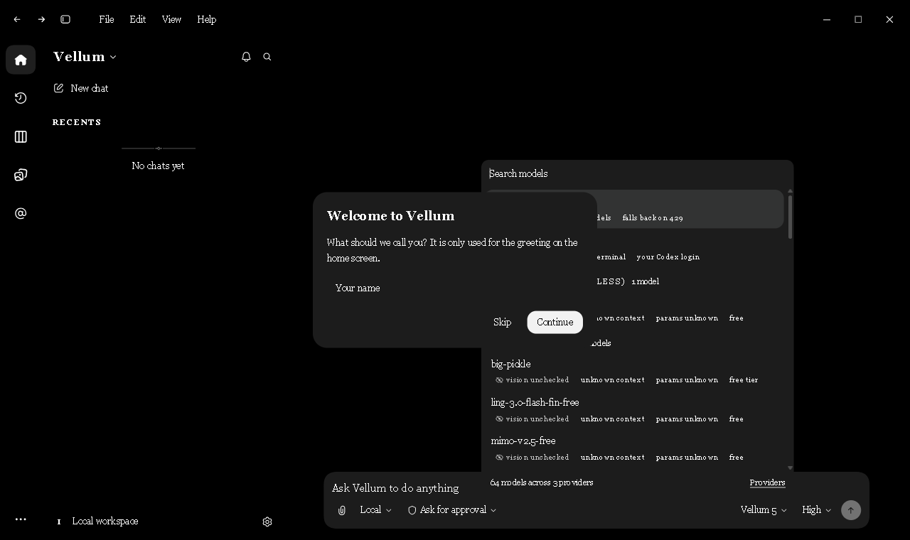

# Vellum

A local, fully usable recreation of the Codex desktop app frontend (dark-first, rebranded — no OpenAI/Codex names or logos). Vite + React + TypeScript frontend, Tauri v2 desktop shell, native Rust backends: a free-model router ("Vellum 5") and a Codex CLI harness.



## Run it

```bash
npm install
npm run dev        # browser at http://localhost:5173
npm run app:dev    # the real desktop app (Tauri)
```

Other scripts: `npm run build` (typecheck + web bundle), `npm run app:build` (desktop installers), `npx tsc -b` (typecheck only).

## Install & updates

Grab the installer from **[Releases](https://github.com/Iyadobo/vellum/releases)** (`Vellum_0.1.0_x64-setup.exe`, NSIS, a few MB — no Node or Rust needed at runtime). The desktop app updates itself from GitHub Releases via the Tauri updater (`Help → Check for updates…`); `.github/workflows/release.yml` builds, signs and publishes on every `v*` tag. Update bundles are signed with a minisign key — the public key is pinned in `src-tauri/tauri.conf.json`, the private key lives only in the maintainer's keychain and GitHub Actions secrets.

The shipped app starts with **no pre-made chats**: first run asks your name once, then greets you with an empty workspace.

## What is real (not a gimmick)

- **Persistence.** Threads, settings, layout, panel tabs, pins, archives, renames and unarchived state persist in `localStorage` (`vellum:v1`). Reload and everything is still there.
- **First run** asks for your name once (persisted; also editable in Settings → General → Your name) and greets you with it on the home screen.
- **Working agent loop, three backends.** `Vellum 5` streams through the native router; `Codex · local CLI` runs the installed Codex CLI (`codex exec --json`) as a true harness with tool rows for commands and file edits; `vellum-1 (demo)` simulates runs offline. Stop cancels any backend; typing while a run is active queues (steer).
- **Codex harness.** The Rust side spawns `codex exec --json` (workspace-write sandbox, `--skip-git-repo-check`) and streams JSONL events into the thread: messages, reasoning, `command_execution` → “Ran …” rows, `file_change` → “Edited …” rows, errors surfaced honestly. Cancel kills the process tree.
- **Command menu** (`Ctrl+K` / `Ctrl+Shift+P`): fuzzy thread + command search, keyboard-navigable, groups match the reference.
- **Settings** (`Ctrl+,`): General, Appearance, Keyboard shortcuts, Archived chats are fully wired (theme, motion, cursors, diff markers, send shortcut, follow-up behavior persist).
- **Right panel**: Subagents, Review (real diff viewer over the active thread), Files (filterable tree), Terminal, Browser — tabs are openable/closable and the panel is resizable.
- **Shell**: resizable sidebar and panel, collapsible sidebar (`Ctrl+B`), real menus everywhere (File/Edit/View/Help, rail overflow, sidebar title, thread kebab, chat context menu), rename + delete dialogs, toasts.
- **Keyboard**: `Ctrl+K`, `Ctrl+N`, `Ctrl+B`, `Ctrl+Alt+B`, `Ctrl+Shift+E`, `Ctrl+1..9`, `Ctrl+,`, `Ctrl+/`, `Esc`.

## Fidelity

The design tokens in `src/styles/tokens.css` are transcribed verbatim from the shipped app bundle (primitives, semantic `--color-*`, control sizes, heights, shadows, motion, radii with the `superellipse(1.5)` ×1.25 corner scale). Icons in `src/components/Icon.tsx` are the app's real SVG path data, rebranded. The default theme is `vellum` — black and blue (pure-black window, blue-lifted panels, blue accents). Stock palettes remain: `dark` (app default), `light`, and `midnight` (the sampled custom theme from the reference machine).

Reference material lives in `reference/`:
- `raw/` — captures of the real app on this machine (main, command menu, zoom crops)
- `official/` — official press screenshots (dark/light, home/composer, appearance settings, review pane, Windows window)
- `iter/` — iteration screenshots of this clone + `audit-01.json` (viewport audit output)

Verification tooling (dev-only, no deps): `tools/shot.mjs` (CDP screenshots against headless Edge) and `tools/audit.mjs` (viewport/typography/target-size audit).

## Real backend — "Vellum 5"

The Tauri build ships a native router (`src-tauri/src/router/`, contract frozen in `BACKEND_CONTRACT.md`) that applies the OmniRoute mechanism locally — no gateway server, no OmniRoute code: a pool of free providers, health/quota-aware auto-fallback, circuit breakers, per-model failure memory, and live model catalogs.



- **Providers**: Pollinations (keyless), OpenCode Zen (keyless `-free` ids + key), OpenRouter (`:free`), Groq, Google Gemini, Z.AI, and a custom OpenAI-compatible endpoint. Keys live only in `%APPDATA%\com.iyad.vellum\providers.json`; reads also fall back to env vars (`GROQ_API_KEY`, `OPENROUTER_API_KEY`, …) and to OpenCode's own `~/.local/share/opencode/auth.json` store.
- **Vellum 5** is the default model: it starts from the last-good model, prefers free models, walks the fallback chain on network errors, 401/403/429/5xx, learns which models 403 (`modelFailures`) and which providers prefer buffered responses, opens a 1–10 min circuit after repeated provider failures, and streams every move into the thread ("Vellum 5 → provider · model", "Rerouted to …").
- **Real classifiers** on the picker: `vision` (OpenRouter modalities / Pollinations flags / family table), `contextWindow` (API `context_length`/`context_window`, else family), `paramsBillions` (parsed from the model id), `reasoning` (API `supported_parameters`, model families, plus *runtime observation* — if a model streams reasoning deltas it is marked observed), and `free` (OpenRouter pricing, Zen `-free` ids). Unknowns are shown honestly as “vision unchecked / unknown context / params unknown”.
- **Reasoning** works for every model that exposes it (`delta.reasoning`, `reasoning_content`, or `thinking`): rendered as a collapsible serif “Thought process” block that auto-expands while streaming.

Tested live on this machine: `glm-5.3-flash`, `glm-5.3`, `qwen3.8-flash`, `minimax-m3`, `space-bunny-free` respond through OpenCode Zen with real reasoning; Pollinations was down (`ENOSPC`) during testing, and the router correctly burned through failures to reach Zen.

## Art direction — "Scriptorium"

Type-led, per the project's own evidence: the product is named after fine writing material, and the user asked for a plain, text-first instrument. The **default theme is `bw` — Black & White set in Georgia** (UI, headings, greeting all Georgia; code stays JetBrains Mono). The `vellum` (black & blue) theme swaps the display voice to **Fraunces** for headings/initials plus **Source Serif 4** editorial lines — all self-hosted OFL fonts from `07 Assets/fonts` (`editorial-ink`, `brutalist-mono`), with provenance in `public/fonts/licenses/`.

Where the direction shows:
- **Home greeting**: one line — `What are we working on today, {name}?` — with the name captured by a one-time welcome prompt (changeable in Settings → General → Your name).
- **Drop cap**: the first prose paragraph of an assistant reply opens with a two-line blue "initial" in the *vellum* theme (`initial-letter`).
- **Sidebar**: serif masthead; `PINNED` / `RECENTS` as letterspaced small caps; the panel is a grey column distinct from the black canvas; the empty state is an ornament rule + a serif line.
- **Thread**: running-head title and `Worked for Xs` rows in the display face; code and diffs in JetBrains Mono.

Ornament geometry lives in `src/components/Ornament.tsx` (SVG, currentColor). No gradient/glow/noise fills — the composition is carried by type, rules, and spacing.

## Known deviations (honest list)

- Chat/markdown text is 13px, matching the real app (`--codex-chat-font-size: 13px`). The Web Craft Standard's 14px floor is therefore violated by design; change the token to 14px if you prefer the floor over fidelity.
- Interactive chrome is compact (24–36px targets) matching the desktop app; it does not meet the 44px touch-target rule.
- Simulated agent output: the engine produces plausible demo runs; there is no model backend.
- Browser pane, file opening, commit, and terminal input are intentionally read-only and say so.
- Environments (Worktree/Cloud) and worktree creation are UI-only; `Local` is the working mode.
- No i18n, no window-manager integration (it is a web app, not an Electron shell).
